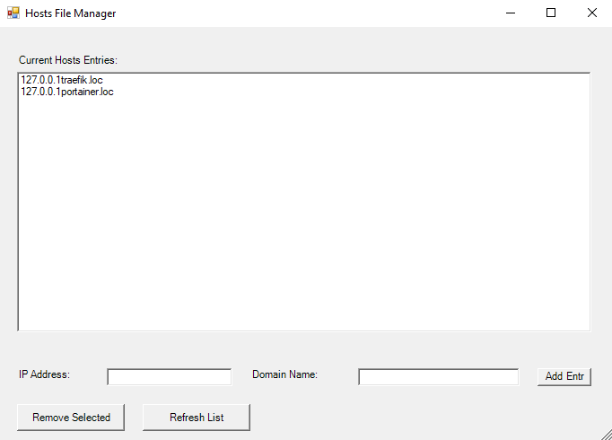

# Windows Host Entry Helper

This is a small application for editing the windows hosts file.

## Install

1. Clone this repository.
2. Execute the `startEditHostsGUI.bat` file.
3. Right click the `startEditHostsGUI.bat` file and selecting "Create shortcut". This way you can modify the name and the icon of the shortcut for better visual appearance. (optional)

## UI

This is the user interface of the application.

